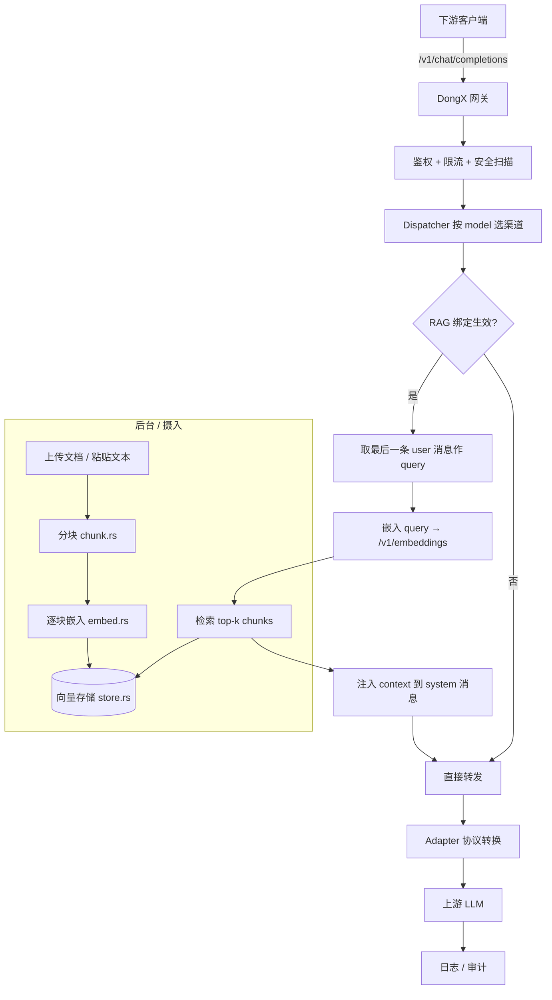

# DongX RAG 模块架构设计（草案 v1）

> 状态：架构分析草案，待讨论定稿。本文件为"文档落地"产物，代码尚未实现。
> 关联模块：`src-tauri/src/{server,core,adapter,db,models,commands}`，`src-tauri/migrations/`。

---

## 0. 目标与定位

DongX 是**本地 LLM API 网关**（Tauri2 + Axum 数据面 + Tauri 管理面）。RAG（检索增强生成）在网关语境下的价值是：**下游客户端（如编码工具）无需感知 RAG，网关在转发 chat 请求前透明地检索用户知识库并把相关片段注入上下文**。

- **做**：摄入、分块、嵌入、向量存储、检索、注入、知识库管理 UI。
- **不做（v1）**：独立对话/RAG 应用、多租户、云端向量库、PDF 之外的复杂文档解析（见 D5）。

设计原则：复用现有双层架构与 dispatcher/adapter/key/quota 机制，**不另起炉灶**；新增代码集中在独立 `rag/` 模块，对数据面热路径仅做"可选挂点"式侵入。

---

## 1. 现状盘点

### 1.1 已具备（可直接复用）
| 资产 | 位置 | 说明 |
|---|---|---|
| `/v1/embeddings` 路由 | `server/router.rs:12` | 已挂到 `handler::embeddings` |
| `NativeEndpoint::Embeddings` 枚举 | `models/channel_presets.rs:79` | 端点能力已定义，但**无任何 preset 启用** |
| `request_logs.mode = embedding` | `models/mod.rs:69` 等 | 日志已预留 embedding 模式 |
| 选渠道 / 转发 / 鉴权 / 配额 | `core/dispatcher.rs`、`adapter/*`、`commands/key.rs` | 嵌入调用可直接复用 |
| 内部统一表示 = OpenAI Chat | `protocol/*` | 注入点统一在 Chat 层，天然兼容 chat/responses/messages |

### 1.2 缺口（必须新建）
1. `handler::embeddings` 是 501 stub（`server/handler.rs:560`）。
2. 无向量表（无 sqlite-vec，也无暴力检索实现）。
3. 无检索 API / 检索逻辑。
4. 无知识库管理 UI。
5. 无 RAG 配置落地点（KB 定义、绑定、分块/检索参数）。
6. 无 preset 启用 `Embeddings` 端点（前端勾选框不会出现）。

---

## 2. 总体架构



### 2.1 六大子模块
| 子模块 | 职责 | 新建文件 |
|---|---|---|
| 配置 / KB 管理 | KB/文档/绑定 CRUD、参数 | `commands/rag.rs` |
| 摄入 | 文本抽取 → 分块 → 调嵌入 → 落库 | `rag/ingest.rs` |
| 嵌入 | 封装 `/v1/embeddings` 调用（复用 dispatcher） | `rag/embed.rs` |
| 存储 | 向量持久化 + 余弦检索 | `rag/store.rs`、`rag/retrieve.rs` |
| 注入 | 把检索结果拼进 OpenAI Chat messages | `rag/inject.rs` |
| 触发/绑定 | 决定某渠道是否启用 RAG、用哪些 KB、检索参数 | `rag_bindings` 表 + `run_chat_pipeline` 挂点 |

### 2.2 与现有代码映射
- **嵌入调用** = `handler::embeddings` 实现 + `rag/embed.rs`，底层走 `core/dispatcher` 选渠道 → `adapter`（OpenAI 系直接 POST `/v1/embeddings`）→ 配额/密钥复用。
- **注入挂点** = `server/handler.rs` 的 `run_chat_pipeline`：在 `normalize_developer_role` 之后、`adapter` 转发之前插入 RAG 步骤（此时已是 OpenAI Chat 内部表示）。
- **迁移** = 新增 `009_rag.sql`（**禁止改动 001–008**，sqlx 字节校验会 panic）。

---

## 3. 数据模型（迁移 `009_rag.sql`）

RAG 实体是**结构化多值对象**，用独立表而非 KV（`settings` 表只存标量开关）。

```sql
-- 知识库定义
CREATE TABLE IF NOT EXISTS knowledge_bases (
  id              TEXT PRIMARY KEY,
  name            TEXT NOT NULL,
  description     TEXT NOT NULL DEFAULT '',
  embedding_channel_id TEXT NOT NULL,   -- 用哪个渠道做嵌入（FK channels.id）
  embedding_model TEXT NOT NULL,        -- 如 text-embedding-3-small
  chunk_size      INTEGER NOT NULL DEFAULT 800,
  chunk_overlap   INTEGER NOT NULL DEFAULT 120,
  created_at      TEXT NOT NULL,
  updated_at      TEXT NOT NULL
);
CREATE INDEX IF NOT EXISTS idx_kb_channel ON knowledge_bases(embedding_channel_id);

-- 文档（一次摄入的单元）
CREATE TABLE IF NOT EXISTS kb_documents (
  id          TEXT PRIMARY KEY,
  kb_id       TEXT NOT NULL,
  title       TEXT NOT NULL,
  source_type TEXT NOT NULL,   -- file | text
  source_ref  TEXT,            -- 文件路径 / 外部引用（本地文件仅记名，内容已入 chunks）
  char_count  INTEGER NOT NULL DEFAULT 0,
  chunk_count INTEGER NOT NULL DEFAULT 0,
  status      TEXT NOT NULL DEFAULT 'ready',  -- ready | indexing | error
  created_at  TEXT NOT NULL
);
CREATE INDEX IF NOT EXISTS idx_doc_kb ON kb_documents(kb_id);

-- 分块（向量存储单元）
CREATE TABLE IF NOT EXISTS kb_chunks (
  id          TEXT PRIMARY KEY,
  kb_id       TEXT NOT NULL,
  doc_id      TEXT NOT NULL,
  seq         INTEGER NOT NULL,
  content     TEXT NOT NULL,
  embedding   TEXT NOT NULL,   -- JSON 数组 f32（暴力检索方案，见 D1）
  token_est   INTEGER NOT NULL DEFAULT 0,
  hash        TEXT NOT NULL    -- 内容去重 / 增量重嵌
);
CREATE INDEX IF NOT EXISTS idx_chunk_kb ON kb_chunks(kb_id);
CREATE INDEX IF NOT EXISTS idx_chunk_doc ON kb_chunks(doc_id);

-- 渠道↔知识库 绑定（触发与检索参数）
CREATE TABLE IF NOT EXISTS rag_bindings (
  id              TEXT PRIMARY KEY,
  channel_id      TEXT NOT NULL,
  kb_ids          TEXT NOT NULL DEFAULT '[]',  -- JSON 数组
  enabled         INTEGER NOT NULL DEFAULT 1,
  top_k           INTEGER NOT NULL DEFAULT 4,
  score_threshold REAL NOT NULL DEFAULT 0.0,
  inject_mode     TEXT NOT NULL DEFAULT 'system',  -- system | append
  template        TEXT NOT NULL DEFAULT '',  -- 空=默认模板
  created_at      TEXT NOT NULL
);
CREATE INDEX IF NOT EXISTS idx_binding_channel ON rag_bindings(channel_id);
```

> `embedding` 列用 `TEXT`（JSON 数组）而非 `BLOB`，是为规避 sqlx 对 `Vec<f32>` 序列化的额外处理；检索时在 Rust 侧 `serde_json` 解析为 `Vec<f32>` 做余弦。**若选 D1 的 sqlite-vec 方案，此列改为扩展类型 `vec0`**（见 §4.3）。

---

## 4. 各组件设计

### 4.1 嵌入服务（`rag/embed.rs` + `handler::embeddings`）
- `handler::embeddings`：解析 OpenAI 格式请求 → 用 `core/dispatcher` 按 `model` 选渠道（渠道需 `endpoints` 含 `embeddings` 且 `models` 含该嵌入模型）→ 经 `adapter` 转发上游 `/v1/embeddings` → 原样返回 → 记日志 `mode=embedding`。
- 复用现有密钥/配额/故障转移，**无需新适配器类型**（OpenAI 系嵌入就是 POST `/v1/embeddings`）。
- `rag/embed.rs::embed_texts(channel, model, &[String]) -> Vec<Vec<f32>>`：批量嵌入，供摄入管线调用；带文本 hash 缓存（同内容不重复嵌）。

**启用端点的最小改动**：在 `channel_presets.rs` 的 OpenAI 系 preset（OpenAI/Google/DeepSeek/Qwen/Zhipu/Doubao/Moonshot/Ollama 及 custom OpenAI）的 `native_endpoints` 中加入 `NativeEndpoint::Embeddings`，并在 `default_checked_endpoints` 视情况加入。这样前端渠道编辑页会出现"Embeddings"勾选项，用户列出嵌入模型即可。

### 4.2 分块（`rag/chunk.rs`）
- v1：**定长字符分块 + 重叠**（按 `chunk_size`/`chunk_overlap`，按换行边界对齐，避免切断句子）。
- 估算 token（`token_est`）用于注入预算控制。
- 后续可加语义分块（句/段聚类），不在 v1。

### 4.3 向量存储与检索（`rag/store.rs` / `rag/retrieve.rs`）—— **D1 待定**
- **方案 A（推荐 v1）：暴力余弦检索**。向量存 `kb_chunks.embedding`（JSON f32），检索时 `SELECT` 该 KB 全量 chunks → Rust 内算余弦 → 取 top-k。本地单用户、KB 规模通常数千 chunk，O(n) 扫描为亚毫秒~毫秒级，零额外依赖、零打包负担。
- **方案 B：sqlite-vec 扩展**。真实 ANN 索引，但需：(a) sqlx 加载扩展（`SqliteConnectOptions::extension` 支持度需验证）；(b) 把 `vector0` 扩展随 Tauri 打包到各平台（Windows `.dll` / macOS `.dylib`），增加发布复杂度。建议作为后续可选项，不在 v1 阻塞。
- 检索：`retrieve(query_vec, kb_ids, top_k, score_threshold) -> Vec<(chunk, score)>`，余弦相似度，可选阈值过滤。

### 4.4 检索注入（`rag/inject.rs` + `run_chat_pipeline` 挂点）
- 触发条件：`rag_bindings` 中该 `channel_id` 存在且 `enabled=1`。
- query 取**最后一条 user 消息**的文本（多轮对话用最新提问检索，最符合 RAG 直觉）。
- 注入样式（**D3 待定**）：默认作为一条 `system` 消息前置（`<context>...</context>`），模板可配；或 `append` 到最后一条 user 消息末尾。
- 预算控制：拼接后若超 `token_est` 预算，截断低分 chunk。
- **注入在 OpenAI Chat 内部表示层做**，所以 chat/responses/messages 三种入口天然统一（经 `protocol/*` 转写后一致）。

### 4.5 触发与绑定
- 绑定粒度 = **渠道级**（一个渠道可绑多个 KB）。
- 支持请求级覆盖：客户端在 `extra_body.rag = { kb_ids, enabled }` 传入可临时开关/指定（**D2 待定**是否开放）。

### 4.6 配置 / UI（前端，`src/`）
- 知识库页：列表 / 新建 / 删除 / 上传文档 / 查看 chunks。
- 渠道编辑页：新增"RAG 绑定"区（选 KB + top_k + 阈值 + 注入方式）。
- 设置页：默认嵌入渠道/模型、默认分块参数（可被子项覆盖）。

---

## 5. 模块布局（Rust）

```
src-tauri/src/
├── rag/
│   ├── mod.rs          # 类型再导出 + RagConfig 读取
│   ├── models.rs       # KnowledgeBase / KbDocument / KbChunk / RagBinding
│   ├── embed.rs        # 嵌入调用（复用 dispatcher/adapter）
│   ├── chunk.rs        # 分块策略
│   ├── store.rs        # 持久化（sqlx query! 宏，依赖 009 迁移）
│   ├── retrieve.rs     # 余弦检索 top-k
│   ├── inject.rs       # 拼接到 OpenAI Chat messages
│   └── ingest.rs       # 摄入编排（上传→分块→嵌入→落库）
├── commands/rag.rs     # Tauri 命令（KB/文档/绑定 CRUD）
├── server/handler.rs   # embeddings 实现 + run_chat_pipeline 挂 RAG 步骤
└── models/channel_presets.rs  # OpenAI 系 preset 加 Embeddings 端点
migrations/009_rag.sql  # 新建表
```

> 注：`db/repository.rs` 现有 `settings_get` 等函数；RAG 数据访问放 `rag/store.rs` 自行持有 sqlx 查询，避免改动现有 repository 结构。新增 `query!` 宏需在编译期连到已迁移的 DB（现有铁律：本地 `.tmpcheck` 编译验证）。

---

## 6. 分阶段实现计划

- **Phase 0 — 打通嵌入（最小可用）**：实现 `handler::embeddings` + 给 OpenAI 系 preset 加 `Embeddings` 端点。用 `curl` 打 `/v1/embeddings` 验证能拿到向量。
- **Phase 1 — 存储+摄入+检索闭环（后端）**：`009_rag.sql` + `rag/{store,retrieve,chunk,embed,ingest}` + `commands/rag.rs`。用 `curl` 走"建 KB→传文档→检索"验证。
- **Phase 2 — 注入进 chat 管线**：`run_chat_pipeline` 挂 RAG 步骤 + `rag/inject.rs` + `rag_bindings` 绑定。验证下游无感知即获上下文。
- **Phase 3 — 前端 KB 管理与绑定 UI**：知识库页 + 渠道绑定区。
- **Phase 4 — 优化（可选）**：嵌入缓存、token 预算截断、PDF/语义分块、sqlite-vec 备选。

---

## 7. 关键决策点（待讨论）

| # | 决策 | 我的建议 | 影响面 |
|---|---|---|---|
| **D1** | 向量存储：暴力余弦 vs sqlite-vec | **暴力余弦（方案 A）** | store.rs 实现、迁移列类型 |
| **D2** | 触发模型：渠道绑定自动注入 vs 请求级 opt-in vs 两者 | **绑定自动 + 请求级可覆盖** | 注入挂点、前端 |
| **D3** | 注入样式：system 消息 vs 追加 user | **system 消息 + 可配模板** | inject.rs、前端 |
| **D4** | 嵌入来源：复用现有渠道 vs 独立 embedding provider 配置 | **复用渠道**（加 `Embeddings` 端点） | preset 改动、dispatcher 复用 |
| **D5** | v1 摄入格式：仅 txt/md/json vs 含 PDF | **仅纯文本类**（PDF 后置） | 依赖、摄入复杂度 |
| **D6** | 配置落点：独立表 vs settings KV | **独立表（KB/文档/绑定）** | 迁移 009 |

---

## 8. 风险与注意

- **迁移只能新增**：`001–008` 已应用，sqlx SHA-384 字节校验，改则启动 panic。RAG 全部走 `009_rag.sql`。
- **上下文撑爆**：检索结果可能超模型上下文 → 必须有 token 预算截断（§4.4）。
- **安全扫描边界**：注入的检索内容是否再过 `security::scanner`？建议**不过**（本地知识库内容属用户自有，且会显著增加延迟），但需在审计日志可见。
- **嵌入成本/延迟**：摄入阶段批量嵌入有耗时与 API 费用；建议异步摄入 + 进度态。
- **并发写入**：摄入与检索可能并发，chunk 表写用事务，检索读用快照即可（SQLite 单写多读）。

---

## 9. 下一步

1. 你确认 §7 六个决策点（尤其 **D1 向量存储** 和 **D2 触发模型**）。
2. 定稿后我先实现 **Phase 0（embeddings 打通）**，跑通再继续 Phase 1。
3. 每阶段结束你本机 `cargo build` + `npm run build` 验证（铁律：编译/提交归你）。
